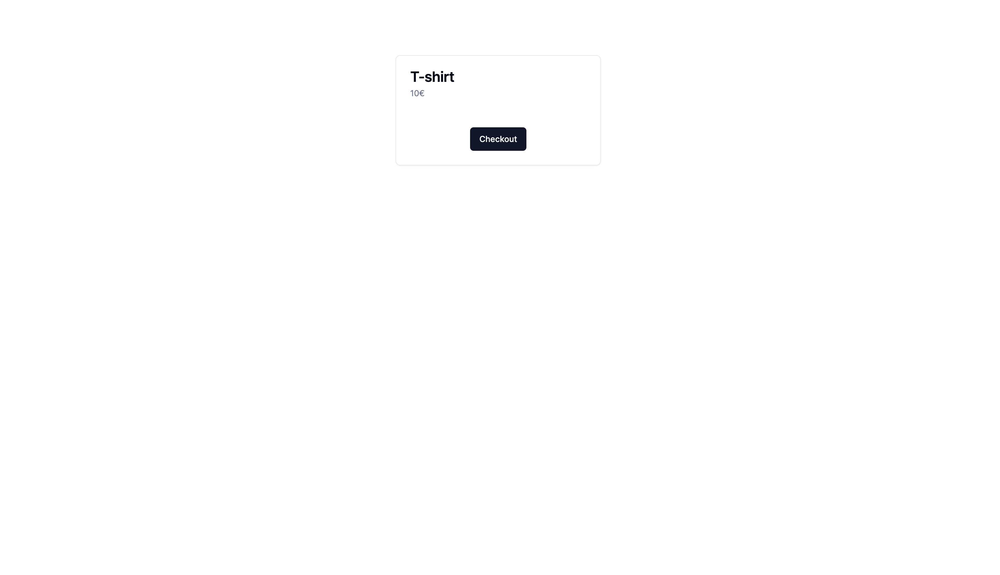

## Next.js Application with Stripe Integration and shadcn/ui Library

This Next.js application integrates Stripe for payment processing and utilizes the shadcn/ui library for an elegant and responsive user interface. It provides a secure and visually appealing e-commerce solution, allowing users to browse, select, and purchase products with ease.

## About this Repository

## Features

    Passwordless authentication using Magic Link
    Seamless login experience via email links
    Secure user management and data storage with Supabase

## Technologies Used

    Next.js - React framework for server-side rendering and web application development
    Stripe - Online payment platform for businesses
    React - JavaScript library for building user interfaces
    Node.js - JavaScript runtime environment for server-side development
    Tailwind CSS - Utility-first CSS framework for designing user interfaces
    shadcn/ui - Reactive and elegant React UI library

## Running Locally

    Clone this repository to your local machine.
    Install dependencies by running yarn install.
    Configure your Stripe account and obtain your API keys.
    Set your Stripe API keys in the environment variables.
    Start the application with yarn dev.
    Access http://localhost:3000 in your browser to explore the application.

Explore the source code to understand how the integration of Stripe and shadcn/ui is implemented in this Next.js application.

Feel free to explore the source code to better understand the implementation of Google authentication with Supabase in a Next.js application.

# Screenshot

